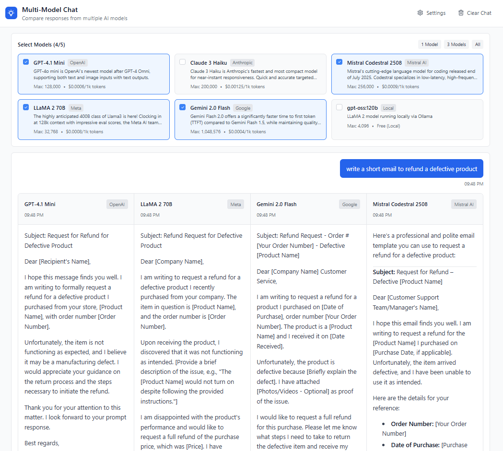

# Multi-Model Chat

A modern web application that allows you to chat with multiple large language models simultaneously and compare their responses in real-time.

### ✨ [**View Live Demo**](https://multi-model-chat-swart.vercel.app/) ✨

## Screenshot



## Features

-   **Concurrent Model Queries**: Chat with up to 5 different AI models at the same time.
-   **Real-time UI Updates**: See responses from each model appear individually as soon as they are available.
-   **Local Model Support**: Connect to locally hosted models (e.g., via Ollama) and compare them against cloud-based APIs.
-   **Remote API Integration**: Natively supports any OpenAI-compatible endpoint, with OpenRouter configured out of the box.
-   **Markdown Rendering**: Displays responses with rich text formatting and syntax highlighting for code.
-   **Persistent Settings**: Your API keys and model configurations are saved locally in your browser.
-   **Responsive Design**: A clean, modern UI that works seamlessly on desktop and mobile devices.

## Supported Models

This application can connect to a wide variety of models through services like OpenRouter or by connecting to your own local servers. The default configuration includes:

-   **GPT-4.1 Mini** (OpenAI)
-   **Claude 3 Haiku** (Anthropic)
-   **Mistral Codestral 2508** (Mistral AI)
-   And any local model you configure!

## Tech Stack

-   **Frontend**: React 18 + TypeScript + Vite
-   **Styling**: Tailwind CSS
-   **State Management**: React Hooks
-   **Markdown**: `react-markdown` with `rehype-highlight`
-   **Icons**: Lucide React

## Getting Started

### Prerequisites

-   Node.js v18 or later
-   NPM, Yarn, or PNPM

### Installation & Setup

1.  **Clone the repository:**
    ```bash
    git clone https://github.com/seehiong/multi-model-chat.git
    cd multi-model-chat
    ```

2.  **Install dependencies:**
    ```bash
    npm install
    ```

3.  **Start the development server:**
    ```bash
    npm run dev
    ```
    Your application should now be running on `http://localhost:3000` (or another port if 3000 is in use).

## Usage

1.  Open the application in your browser.
2.  To query remote models, you will need an API key from a service like [OpenRouter.ai](https://openrouter.ai/).
3.  Navigate to the **Settings** page in the application and paste your API key into the "OpenRouter API Key" field. The key is saved to your browser's `localStorage`.
4.  **Important Security Note:** For maximum security, it is recommended to create temporary keys on your provider's dashboard (like OpenRouter) for your sessions and delete them when you are finished.
5.  On the settings page, you can also configure any **Local Models** you are running (e.g., via Ollama).
6.  Return to the main page, select the models you want to chat with, and start your conversation!

## Deployment

This application is optimized for deployment on static hosting platforms like Vercel, Netlify, or Cloudflare Pages.

### Deploying with Vercel

1.  Fork this repository to your own GitHub account.
2.  Go to [Vercel](https://vercel.com/) and create a new project, importing your forked repository.
3.  Vercel will automatically detect that it is a Vite project and configure the build settings.
4.  **No environment variables are needed for deployment**, as the API key is handled entirely on the client-side.
5.  Deploy!

## Project Structure

```
.
├── public/                # Static assets
├── src/
│   ├── components/        # React components
│   ├── config/            # Model configurations
│   ├── hooks/             # Custom React hooks (useChat)
│   ├── services/          # API and Settings services
│   ├── types/             # TypeScript definitions
│   ├── App.tsx            # Main application component
│   └── main.tsx           # Application entry point
└── package.json
```

## Contributing

Contributions are welcome! If you have a feature request, bug report, or want to improve the code, please feel free to:

1.  Fork the repository.
2.  Create a new branch (`git checkout -b feature/your-feature-name`).
3.  Make your changes.
4.  Commit your changes (`git commit -m 'Add some amazing feature'`).
5.  Push to the branch (`git push origin feature/your-feature-name`).
6.  Open a Pull Request.

## License

This project is licensed under the MIT License. See the [LICENSE](LICENSE) file for details.